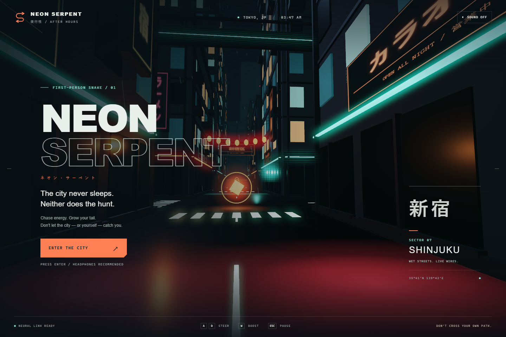

# GPT-6 Astra — xhigh

| Field            | Value                              |
| ---------------- | ---------------------------------- |
| Model            | gpt-6-astra                        |
| Reasoning effort | xhigh                              |
| Provider         | OpenAI                             |
| Harness          | Codex desktop app; version unknown |

## Assistance used

- Skills: [ux-writing](https://github.com/scarletkc/agents), for interface copy and documentation; installed version/commit unknown.
- Tools and plugins: PowerShell, Node.js, npm, Git, and GitHub CLI for implementation, dependency packaging, checks, and PR delivery; Playwright Chromium for browser checks and screenshots; local image viewing for visual review; web access to the npm registry to verify the Three.js package. No visual or audio asset service was used.
- Subagents: none.

## Run

Open [app/index.html](app/index.html) in a browser with WebGL 2. The checked-in application includes its renderer and runs without network requests or a build step.

To serve it over HTTP, run from this model directory with Node.js:

```sh
node serve.mjs
```

Open [localhost:4179](http://127.0.0.1:4179). Set `PORT` to use another port.

### Controls

| Action                    | Control                                       |
| ------------------------- | --------------------------------------------- |
| Start / retry             | Enter or the on-screen button                 |
| Steer                     | A / D or left / right arrows                  |
| Boost                     | Hold W, up arrow, Shift, or Space             |
| Pause / resume            | Escape or P; on-screen pause / resume buttons |
| Sound                     | M or the sound button; initially off          |
| Restart after a collision | R                                             |
| Touch                     | Hold the left, right, and boost buttons       |

The serpent moves continuously. Collect amber cores to gain energy and grow; buildings, the illuminated perimeter, and your own tail end the run. The minimap shows the full district, and the arrow above the crosshair points toward the nearest core. Boost consumes charge, which refills when released. Focus loss pauses the run. The best score is saved when browser storage is available.

## Development

The editable sources are [game.js](app/game.js) (input, UI, game loop), [simulation.mjs](app/simulation.mjs) (movement and collision), [world.js](app/world.js) (procedural Three.js scene), and [audio.js](app/audio.js) (Web Audio synthesis). The static entry loads `bundle.js`, an IIFE that also works in the catalog's opaque-origin sandbox.

From this model directory, using Node.js 24:

```sh
npm ci
npm run build
npm test
npx playwright install chromium
npm run test:browser
npm run test:catalog
```

Rebuild and commit `app/bundle.js` after editing the JavaScript sources. Browser checks regenerate the screenshots. Three.js 0.186.0 is vendored from the [npm distribution](https://registry.npmjs.org/three/-/three-0.186.0.tgz); its unmodified modules and original license are under `app/vendor/`. [Third-party license](app/third-party.html) is included in the static preview.

## Notes

- Shared prompt: [PROMPT.md](../../PROMPT.md), revision `184d49add8535fde75f6b1b5a52cad7e350b3beb`. Implementation started from repository commit `a06a3e673afe36d7d3efeff7b75582ac83261d08`.
- One implementation run, with iterative fixes from test results and screenshot review. The user specified GPT-6 Astra, xhigh, in the Codex app. No subsequent user edits or assistance from other models were used. Other models' implementations were not inspected.
- All buildings, signs, windows, street markings, rain, light effects, snake geometry, energy cores, particles, and sounds are generated in code. Japanese signs use locally available system fonts.
- Motion reduction follows the browser preference: camera sway, steering bank, boost field-of-view changes, rain motion, and pickup flashes are reduced or disabled. Core rotation and necessary gameplay movement remain animated.
- Validation: seven simulation tests cover growth, curved body following, obstacle/perimeter collisions across long frames, self-collision, boost/recharge, seeded spawning, reset, and bounded spawn failure. Browser checks cover desktop and touch controls, score/growth, pause/resume and focus loss, collision/retry, sound controls, narrow layouts, direct HTML opening, the catalog sandbox, WebGL failure handling, and absence of external runtime requests. An isolated catalog test checks model discovery and the exported entry, bundle, stylesheet, and license without loading other implementations.
- Initial browser validation exposed ES-module CORS failures in the sandbox; the distributed IIFE resolves them. A pause check also caught a stale minimap frame, corrected by updating the HUD when pausing.
- Validation environment: Windows, Node.js 24.1.0, Playwright 1.63.0 Chromium with SwiftShader; desktop 1440 × 960 and touch emulation 390 × 844. Physical mobile devices, Safari, and Firefox have not been tested. Frame rate depends on the device's GPU; these checks are not a hardware performance benchmark. Reduced-motion mode was exercised in the touch run.
- Wet-road lighting uses procedural glow decals and bloom. Storage can be unavailable inside the catalog sandbox; gameplay continues with an in-memory best score for that session.



[In-game view](screenshots/desktop-run.png) · [Touch controls](screenshots/mobile-run.png)
