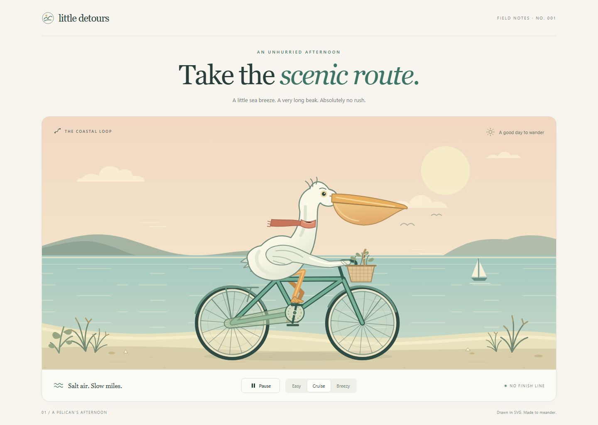
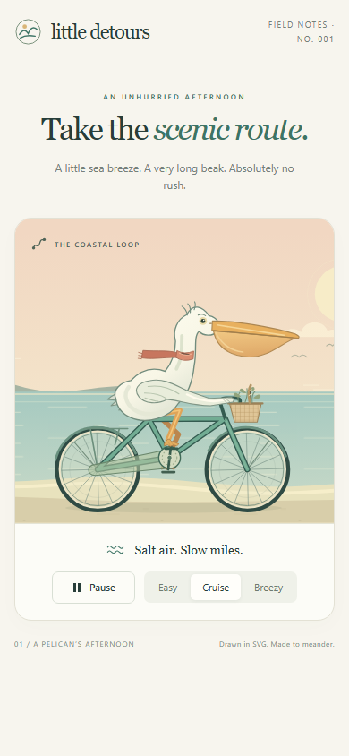

# GPT-6.1 Sol · xhigh

| Field            | Value                                |
| ---------------- | ------------------------------------ |
| Model            | `gpt-6.1-sol`                        |
| Reasoning effort | `xhigh`                                |
| Provider         | OpenAI                               |
| Harness          | Devin CLI 3000.11.3 (`9c803229faa4`) |

The model name and reasoning setting were supplied by the user and current harness; the user confirmed OpenAI as the provider during this run. The supplied name, GPT-6.1 Sol, is formatted as `gpt-6.1-sol` to match the other GPT entries. A separate backend/API model identifier was not exposed and is unknown.

## Prompt

- Shared brief: [PROMPT.md](../../PROMPT.md) at `a8b95396bf15332746b964ff64e0a1a3dd145430`.
- Initial message, with the user's local path redacted:

  > 完成 "[redacted: local path]" 不要参考其他模型的实现，你的模型是 GPT-6.1 Sol 思考为 xhigh，位于 devin cli。开始

- Additions to the shared brief: explicit isolation from other models' implementations; the model identity, xhigh reasoning setting, and Devin CLI harness; a request to complete the project rather than a verbatim use of the standard launch message.
- Later instructions and clarifications, in order:
  1. The harness supplied the available-skill list: `declarative-repo-setup` and `upload-secrets`. Neither matched this standalone animation task, so neither was invoked.
  2. The harness loaded [projects/AGENTS.md](../../../AGENTS.md), requiring implementation isolation, a dedicated branch, the contribution guide, a model record, and a commit/push/open-PR workflow.
  3. The harness loaded [site/AGENTS.md](../../../../site/AGENTS.md), including screenshot-review requirements. No website source was changed.
  4. The assistant asked which Provider to record; the user selected **OpenAI**. This clarified provenance only and did not change the implementation brief.
- Other disclosed run conditions: Windows; this run used the repository contribution guide and model-record template. No additional user-controlled launch flags or custom configuration were supplied or inspected. No persistent memory or previous-session notes were accessed.

## Assistance used

- Skills: none invoked. Skill discovery found no repository skills in the project or repository root.
- Tools and plugins: file inspection/editing tools, PowerShell, Git, GitHub CLI, Python's static HTTP server, the repository's `scripts/screenshot.mjs`, Playwright/Chromium, and the existing Prettier formatter.
- Subagents: none.
- Other models or their implementation code/generated outputs: none consulted. Web research, external art assets, downloaded fonts, and libraries in the app: none. The shared project README was read to add this implementation's result link; no other model's implementation directory or history was inspected.
- Manual assistance: the user's provider confirmation only; no manual source edits or artwork assistance.

## Run

Open [app/index.html](app/index.html) directly in a browser. The app is one self-contained HTML file containing the SVG artwork, styles, and a classic script. It makes no external requests and needs no installation or build step.

For a plain static server, from the repository root:

```sh
python -m http.server 8765 --bind 127.0.0.1 --directory projects/pelican-cycle/models/gpt-6-1-sol-xhigh/app
```

Open `http://127.0.0.1:8765`.

- **Pause / Play** stops or resumes every animated layer.
- **Easy / Cruise / Breezy** changes the complete scene's playback speed to 0.65× / 1× / 1.5× without resuming a paused scene.
- **Space** toggles playback when focus is outside interactive controls. Focused buttons retain their standard keyboard behavior.
- With `prefers-reduced-motion: reduce`, the illustration starts still. Play is an explicit opt-in to motion.
- With JavaScript disabled, the complete still illustration and an explanatory message remain available; controls are disabled.

### Optional verification

The shared brief does not require tests. A small [verification script](verify.mjs) is included for the checks performed during this run. It uses the repository's existing `@playwright/test` development dependency, not an app dependency.

With repository dependencies and Playwright Chromium available, run from the repository root:

```sh
node projects/pelican-cycle/models/gpt-6-1-sol-xhigh/verify.mjs
node projects/pelican-cycle/models/gpt-6-1-sol-xhigh/verify.mjs http://127.0.0.1:8765
```

The first command verifies file-URL loading; the second also verifies playback inside an opaque-origin `sandbox="allow-scripts"` iframe. The HTTP command requires the static server above.

## Notes

### Result

An original, illustrated coastal postcard titled **Take the scenic route**. The white pelican has a long golden bill and throat pouch, a coral scarf, layered feathers, and webbed feet. Its mint-green bicycle has fenders, a chain guard, a wicker basket, and a little picnic. The scene includes a warm sky, sun, hills, sea ripples, a sailboat, and dune plants.

A single animation clock drives the crank, opposite pedals, constant-length two-segment leg geometry, wheel spokes, road texture, slower sea ripples, scarf, clouds, and sailboat. Wheel rotation and road travel share the same wheel-radius calculation. The animation suspends frame scheduling when the document is hidden, and resumes without accumulating the hidden interval.

### Checks performed

- Passed the included Chromium verification script against both the local file and a plain static HTTP server.
- Checked autoplay; complete pause/resume; all three speed settings using a controlled Playwright clock; feet remaining on opposite crank endpoints; finite SVG paths, unique IDs, and valid SVG use references.
- Checked Space and focused-button keyboard behavior; reduced-motion startup and explicit play; actual media-query change events; and JavaScript-disabled static rendering.
- Checked 320, 390, 640, 768, 1024, and 1440 px viewport widths: no document-level horizontal overflow and no cropping of the cyclist.
- Checked playback and controls in an opaque-origin sandbox iframe served over HTTP.
- Captured and visually reviewed the submitted app at desktop and mobile sizes using the repository screenshot helper with `--strict`: no browser console errors, page errors, or failed requests.
- Passed Prettier formatting checks for the app, verification script, and model record, plus Git whitespace checks. Full-site builds and catalog generation were deliberately not run because they scan other models' implementation directories; validation stayed scoped to this submission.

### Original-run iterations and limitations

- One implementation attempt in one continuous autonomous run, with no selection among alternative models or implementations. Code, artwork, and checks were revised within this original run; this is not a post-run repair.
- Inspection caught missing static foot transforms in the JavaScript-disabled fallback; the initial pose and disabled-control labels were corrected. A visible background join in the mobile crop was also corrected.
- Two early verification invocations failed in the verification harness: a wall-clock speed assertion was affected by irregular headless frame timing, and back-to-back motion-preference changes were coalesced before their events fired. The verification now uses a controlled animation clock and waits for actual preference-change events. The final file and HTTP checks passed.
- The animation caps each elapsed frame at 50 ms, so it can slow down on low-frame-rate devices. The speed checks are functional checks under a controlled clock, not a performance benchmark.
- Only Chromium was exercised automatically. Firefox, Safari, touch-device behavior, and assistive-technology behavior were not independently tested.
- Narrow layouts crop the outer scenery while preserving the cyclist. Weather copy is decorative, not live weather data. There is no audio, random generation, external asset download, or backend.

### Environment and screenshots

Run date: 2026-09-30. Windows; Node.js v24.1.0; Python 3.13.14; Playwright from the repository's existing dependencies; Chromium 153.0.8010.12. Devin CLI version was checked with `devin --version`. There is no random seed; the drawing is deterministic and animation frames depend on elapsed playback time.

The following screenshots show the original-run result, captured from a plain local static server. The helper waited 1600 ms after loading; animation was running at Cruise pace. Full-page capture was enabled, so an image can be taller than its viewport.

- [Desktop](screenshots/desktop.png): 1440 × 1000 viewport.
- [Mobile](screenshots/mobile.png): 390 × 844 viewport.




